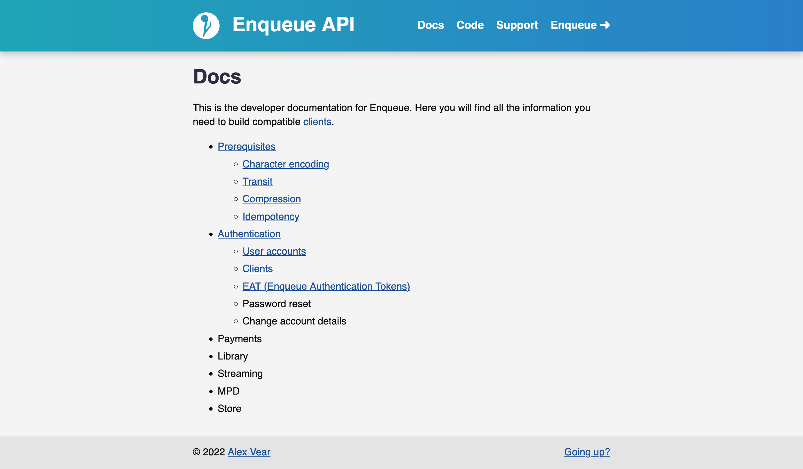
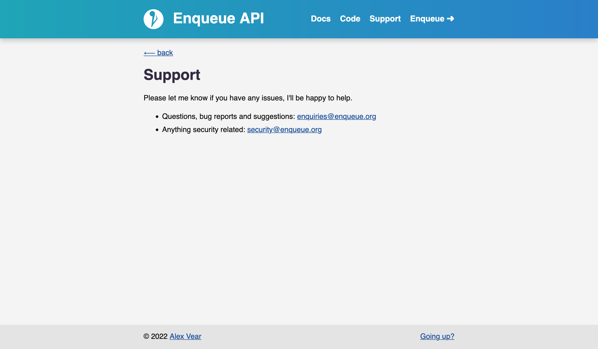
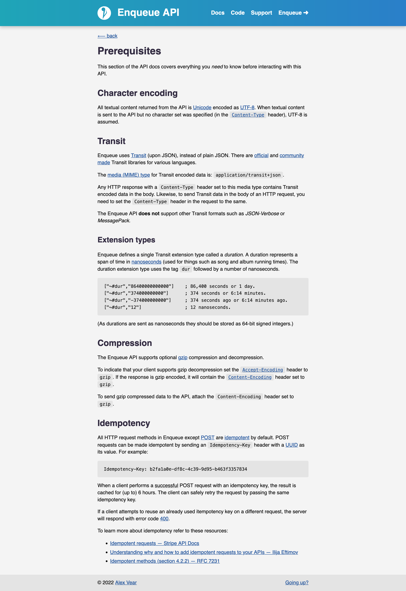
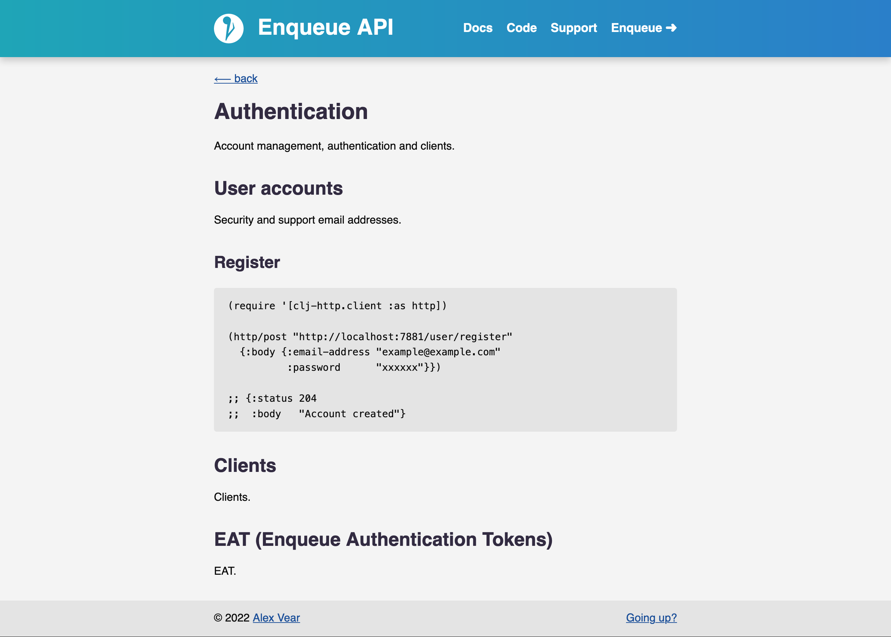

# Enqueue Music (archive)

Enqueue Music was my first big Clojure project.  It was intended to be a music
streaming service.  While it was never completed, I learnt a lot through it's
construction.

The project began on 2020-09-20 and was officially archived on 2023-04-08.
Development was slow and had mostly ceased by April 2022.  For the rest of its
life, the project served as a test bed for trialing libraries and ideas I would
later have.

---

_Public domain.  No rights reserved._
